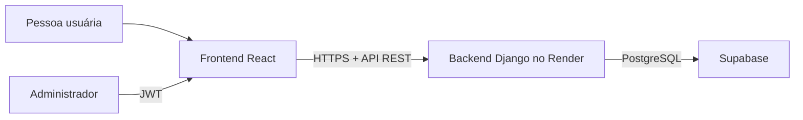

# Sistema de Folgas

Aplicação web para registrar e administrar solicitações de folga de cartomantes. O projeto possui um portal público, para envio de solicitações e consulta da escala aprovada, e um painel administrativo protegido por login.

> Este guia foi escrito para quem está começando. Siga os passos na ordem e copie os comandos conforme o seu sistema operacional.

## O que o projeto faz

- Permite enviar uma solicitação pública de folga com nome, dia e turno.
- Exibe publicamente apenas a escala de folgas já aprovadas.
- Protege o painel de gestão com autenticação JWT.
- Permite que administradores aprovem, recusem e removam solicitações.
- Mantém o banco de produção no PostgreSQL do Supabase.

## Tecnologias

| Camada | Tecnologias |
| --- | --- |
| Backend | Python, Django, Django REST Framework e Simple JWT |
| Frontend | React, Vite, React Router, Tailwind CSS e Axios |
| Banco local | SQLite |
| Banco de produção | PostgreSQL (Supabase) |
| Deploy sugerido | Render para API e Cloudflare Pages para frontend |

## Como as partes se conectam



O frontend nunca deve se conectar diretamente às tabelas do Supabase. Ele se comunica apenas com a API Django.

## Pré-requisitos

Instale antes de começar:

- [Python 3.10 ou superior](https://www.python.org/downloads/)
- [Node.js 18 ou superior](https://nodejs.org/)
- Git (opcional, mas recomendado)

Confira se estão instalados:

```bash
python --version
node --version
npm --version
```

No Windows, se `python` não funcionar, tente usar `py` nos comandos.

## Início rápido no ambiente local

### 1. Clone o projeto

```bash
git clone https://github.com/zGeanx/Sistema_De_Folgas.git
cd Sistema_De_Folgas
```

### 2. Prepare o backend

Crie um ambiente virtual. Ele evita misturar as bibliotecas deste projeto com as de outros projetos Python.

**Windows (PowerShell):**

```powershell
py -m venv .venv
.\.venv\Scripts\python.exe -m pip install --upgrade pip
.\.venv\Scripts\python.exe -m pip install -r requirements.txt
.\.venv\Scripts\python.exe manage.py migrate
.\.venv\Scripts\python.exe manage.py runserver
```

**Linux/macOS:**

```bash
python3 -m venv .venv
./.venv/bin/python -m pip install --upgrade pip
./.venv/bin/python -m pip install -r requirements.txt
./.venv/bin/python manage.py migrate
./.venv/bin/python manage.py runserver
```

O backend ficará disponível em `http://localhost:8000`.

> No desenvolvimento, o projeto usa SQLite automaticamente. Não é necessário configurar Supabase para executar os primeiros testes locais.

### 3. Crie uma conta administrativa local

Em outro terminal, na raiz do projeto, execute:

**Windows:**

```powershell
.\.venv\Scripts\python.exe manage.py createsuperuser
```

**Linux/macOS:**

```bash
./.venv/bin/python manage.py createsuperuser
```

Informe um usuário, e-mail e senha. Essa conta poderá acessar o painel em `/admin/login`.

### 4. Prepare o frontend

Abra outro terminal:

```bash
cd frontend
npm install
```

Crie o arquivo de configuração local a partir do exemplo:

**Windows (PowerShell):**

```powershell
Copy-Item .env.example .env.local
```

**Linux/macOS:**

```bash
cp .env.example .env.local
```

O arquivo `frontend/.env.local` deve conter:

```env
VITE_API_URL=http://localhost:8000/api
```

Inicie o frontend:

```bash
npm run dev
```

Abra a URL mostrada pelo Vite, normalmente `http://localhost:3000`.

## Como usar a aplicação

### Portal público

- Rota: `/`
- **Marcar Folga** envia uma solicitação para análise.
- **Minha Escala** mostra somente solicitações aprovadas.

O portal público não exibe solicitações pendentes, recusadas, observações administrativas, IDs ou informações de usuários.

### Painel administrativo

- Login: `/admin/login`
- Painel: `/admin`

Para entrar, use uma conta criada com `createsuperuser` ou outra conta marcada como administradora (`is_staff=True`).

No painel, o administrador pode:

- Consultar todas as solicitações.
- Aprovar ou recusar uma solicitação.
- Excluir uma solicitação.
- Consultar indicadores e a escala consolidada.

## Rotas da API

A API é servida pelo backend Django. As rotas abaixo começam com `/api/`.

### Autenticação

| Método | Rota | Acesso | Finalidade |
| --- | --- | --- | --- |
| `POST` | `/auth/register/` | Público | Cria uma conta comum, com limite de taxa. |
| `POST` | `/auth/login/` | Público | Retorna tokens JWT e dados da conta. |
| `POST` | `/auth/token/refresh/` | Público | Renova o token de acesso. |
| `POST` | `/auth/logout/` | Autenticado | Invalida o refresh token. |
| `GET` | `/auth/me/` | Autenticado | Retorna o perfil da conta atual. |

### Solicitações e escala

| Método | Rota | Acesso | Finalidade |
| --- | --- | --- | --- |
| `POST` | `/solicitacoes/publicar/` | Público | Envia uma solicitação para análise. |
| `GET` | `/solicitacoes/escala-publica/` | Público | Lista somente nome, dia e turno de folgas aprovadas. |
| `GET` | `/solicitacoes/` | Autenticado | Lista solicitações próprias; administradores veem todas. |
| `POST` | `/solicitacoes/` | Autenticado | Cria uma solicitação vinculada à conta logada. |
| `GET` | `/solicitacoes/minhas_folgas/` | Autenticado | Lista as solicitações visíveis para a conta atual. |
| `POST` | `/solicitacoes/{id}/aprovar/` | Administrador | Aprova uma solicitação. |
| `POST` | `/solicitacoes/{id}/recusar/` | Administrador | Recusa uma solicitação. |
| `DELETE` | `/solicitacoes/{id}/` | Administrador | Exclui uma solicitação. |
| `GET` | `/solicitacoes/estatisticas/` | Administrador | Retorna os indicadores do painel. |

Para as rotas autenticadas, envie o token no cabeçalho:

```http
Authorization: Bearer SEU_TOKEN_DE_ACESSO
```

## Regras de negócio e segurança

- As solicitações começam com status `pendente`.
- Somente administradores aprovam, recusam ou excluem solicitações.
- A rota pública de solicitação aceita apenas nome, dia e turno.
- A escala pública retorna apenas registros aprovados e campos próprios para exibição.
- Rotas públicas possuem limite de taxa para reduzir abuso.
- Tokens de atualização podem ser invalidados no logout.
- Em produção, a API exige `SECRET_KEY`, `DATABASE_URL`, `ALLOWED_HOSTS` e CORS explícito.

## Configuração para produção

Em produção, cadastre as variáveis diretamente no provedor de hospedagem. O backend não lê automaticamente um arquivo `.env`.

### Backend no Render

| Variável | Exemplo | Observação |
| --- | --- | --- |
| `DJANGO_SETTINGS_MODULE` | `config.settings.production` | Obrigatória em produção. |
| `SECRET_KEY` | valor aleatório longo | Nunca envie ao Git. |
| `DATABASE_URL` | URL do Session Pooler do Supabase | Use a URL completa copiada em **Supabase → Connect**. |
| `ALLOWED_HOSTS` | `seu-backend.onrender.com` | Sem `https://` e sem `/`. |
| `CORS_ALLOWED_ORIGINS` | `https://seu-frontend.pages.dev` | Com `https://`, sem barra final. |
| `JWT_ACCESS_TOKEN_LIFETIME` | `60` | Opcional; valor em minutos. |
| `JWT_REFRESH_TOKEN_LIFETIME` | `1440` | Opcional; valor em minutos. |

O `Procfile` executa as migrations antes de iniciar o Gunicorn:

```text
web: python manage.py migrate && gunicorn config.wsgi:application --log-file -
```

### Frontend no Cloudflare Pages

Configure esta variável no build do frontend:

```env
VITE_API_URL=https://seu-backend.onrender.com/api
```

Configuração sugerida:

| Campo | Valor |
| --- | --- |
| Diretório raiz | `frontend` |
| Comando de build | `npm run build` |
| Diretório de saída | `frontend/dist` ou `dist`, conforme o diretório raiz escolhido |

> Variáveis que começam com `VITE_` são inseridas no build. Depois de alterar `VITE_API_URL`, faça um novo deploy do frontend.

## Supabase e proteção das tabelas

O Supabase é usado apenas como PostgreSQL para o Django. Não exponha tabelas do Django (`auth_user`, `django_session`, `solicitacoes_folga` e similares) para acesso direto do navegador.

No Supabase, mantenha RLS habilitado nas tabelas públicas e não conceda permissões a `anon` ou `authenticated` para as tabelas gerenciadas pelo Django. O acesso deve continuar passando pela API Django.

## Testes e qualidade

### Backend

```bash
python manage.py test tests
```

No Windows, usando o ambiente virtual criado acima:

```powershell
.\.venv\Scripts\python.exe manage.py test tests
```

### Build do frontend

```bash
cd frontend
npm run build
```

Execute os testes e o build antes de enviar mudanças para produção.

## Estrutura de pastas

```text
Sistema_De_Folgas/
├── apps/
│   ├── escala/                 # Modelo, regras e API de solicitações
│   └── users/                  # Cadastro, login e perfil de usuários
├── config/
│   ├── settings/               # Configurações de desenvolvimento e produção
│   ├── urls.py                 # Rotas principais do Django
│   └── wsgi.py                 # Entrada usada pelo servidor Gunicorn
├── frontend/
│   ├── src/
│   │   ├── components/         # Componentes visuais reutilizáveis
│   │   ├── contexts/           # Estado de autenticação do painel
│   │   ├── hooks/              # Lógica reutilizável para folgas
│   │   ├── pages/              # Páginas pública, login e administração
│   │   └── services/           # Comunicação com a API
│   ├── .env.example            # Modelo de variável do frontend
│   └── package.json            # Scripts e dependências JavaScript
├── tests/                      # Testes do backend
├── .env.example                # Exemplo de variáveis do backend
├── manage.py                   # Comandos Django
├── requirements.txt            # Dependências Python
└── Procfile                    # Comando de inicialização no Render
```

## Problemas comuns

### `Bad Request (400)` ao abrir o backend

Confira `ALLOWED_HOSTS` no Render. Ele deve conter somente o domínio do backend:

```text
seu-backend.onrender.com
```

### Erro de CORS no frontend

Confira no backend:

```text
CORS_ALLOWED_ORIGINS=https://seu-frontend.pages.dev
```

Não coloque `/api` nem barra final nessa variável.

### Frontend tenta acessar `localhost:8000` em produção

Defina `VITE_API_URL` no provedor do frontend e faça um novo build.

### Não consigo entrar no painel

Crie uma conta administrativa:

```bash
python manage.py createsuperuser
```

Em produção, execute esse comando localmente apontando `DATABASE_URL` para o banco Supabase. Nunca exponha uma rota pública para criar administradores.

## Contribuindo

1. Crie uma branch: `git checkout -b feat/minha-alteracao`.
2. Faça uma alteração pequena e clara.
3. Execute os testes do backend e o build do frontend.
4. Faça commits descritivos, por exemplo: `feat(api): add leave endpoint`.
5. Abra um Pull Request explicando o que mudou e como foi testado.

## Licença

Ainda não há uma licença definida no repositório. Antes de reutilizar ou distribuir o código, adicione um arquivo `LICENSE` com a licença escolhida.
